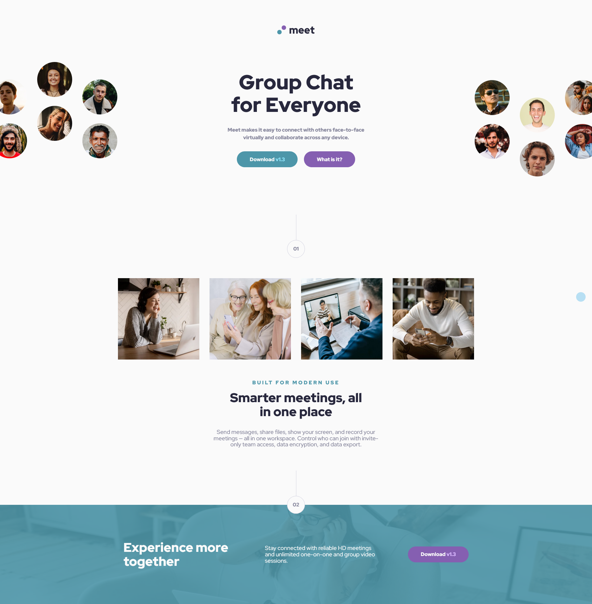

# Frontend Mentor - Meet landing page solution

This is a solution to the [Meet landing page challenge on Frontend Mentor](https://www.frontendmentor.io/challenges/meet-landing-page-rbTDS6OUR). Frontend Mentor challenges help you improve your coding skills by building realistic projects. 

## Table of contents

- [Overview](#overview)
  - [The challenge](#the-challenge)
  - [Screenshot](#screenshot)
  - [Links](#links)
- [My process](#my-process)
  - [Built with](#built-with)
  - [What I learned](#what-i-learned)
  - [Continued development](#continued-development)
- [Author](#author)

## Overview

### The challenge

Users should be able to:

- View the optimal layout depending on their device's screen size
- See hover states for interactive elements

### Screenshot

### Links

- [Solution URL](https://github.com/Trischa-99/Meet-Landing-Page.git)
- [Live Site URL](https://trischa-99.github.io/Meet-Landing-Page/)

## My process

### Built with

- Semantic HTML5 markup
- CSS custom properties
- Flexbox
- CSS Grid

### What I learned

I learned that it's not always best to follow the design pixel by pixel. Instead, I should treat it as a template and make adjustments to ensure it works well in practice.

I also learned that I need to structure my code better right from the start.

### Continued development

I will try to make my code more dynamic and easier to expand, especially in larger projects.

## Author

- Frontend Mentor - [@Trischa-99](https://www.frontendmentor.io/profile/Trischa-99)
